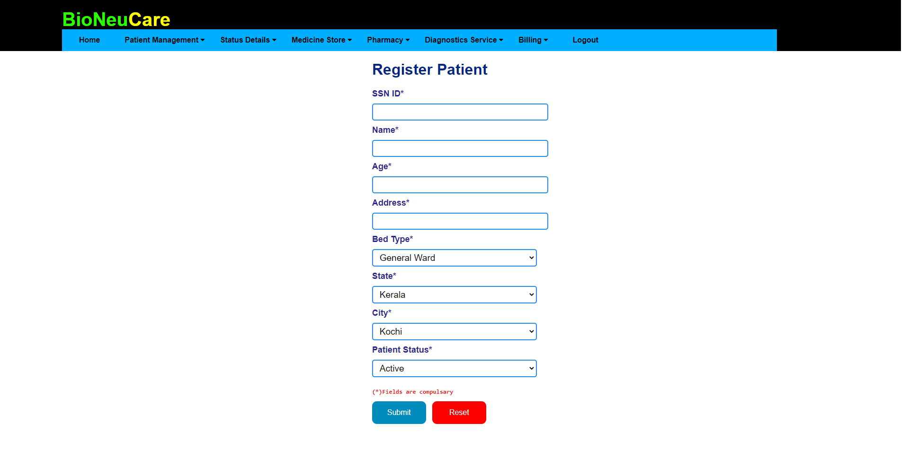
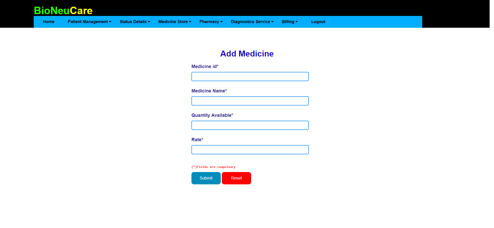
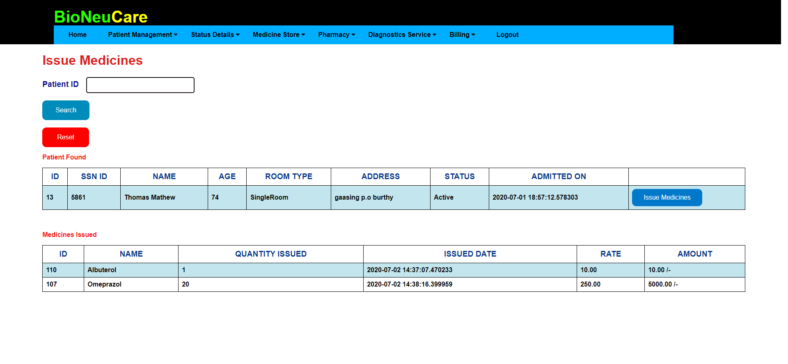
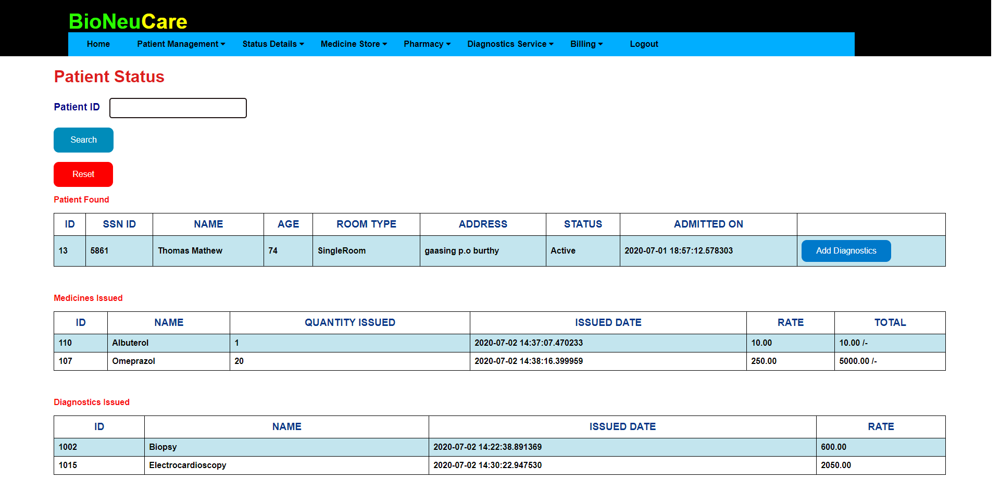
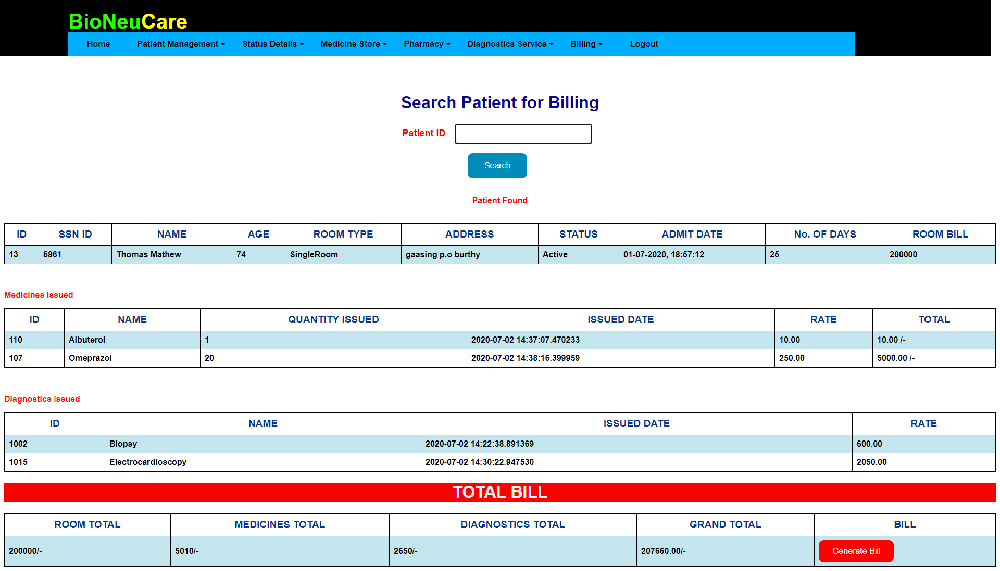
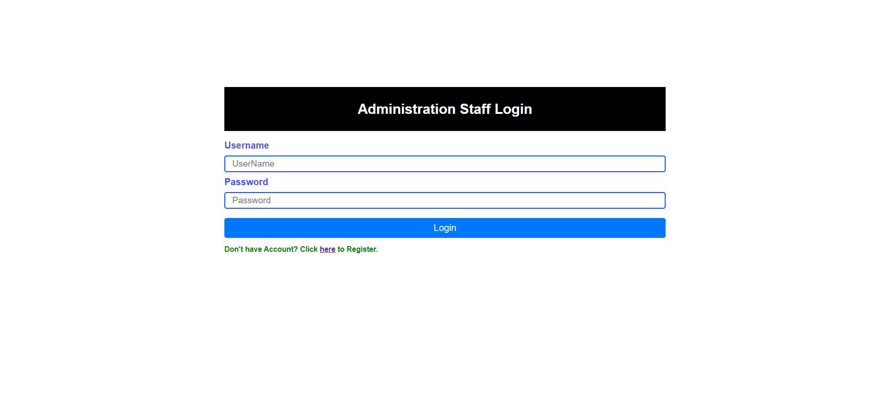

## HospitalManagement
A Simple Hospital Management Project build using Python Flask and SQL Alchemy

### Built With

* [Bootsrap](https://getbootstrap.com/)
* [Flask](https://flask.palletsprojects.com/en/1.1.x/)
* [Jinja](https://jinja.palletsprojects.com/en/2.11.x/)


## Screenshots










<!-- GETTING STARTED -->
## Getting Started

Follow the installation steps to open project without error

### Installation
 
1. Download and extract the project
2. I've used virtual environment. It's not necessary, but using virtual environment is preferable.
```sh

python -m venv venv

```
3. activate virtual env
```sh

D:\flask\HospitalManagement> cd venv/Scripts/activate

After venv is activated

(venv) D:\flask\Retail-Banking>

```
4. Install all the required libraries for the application
```sh

 pip install -r requirements.txt

```
5. To run the code
```sh

D:\flask\Retail-Banking>flask run

```
6. thats it..!!

## hosted on heroku : http://buerocarehospital.herokuapp.com


